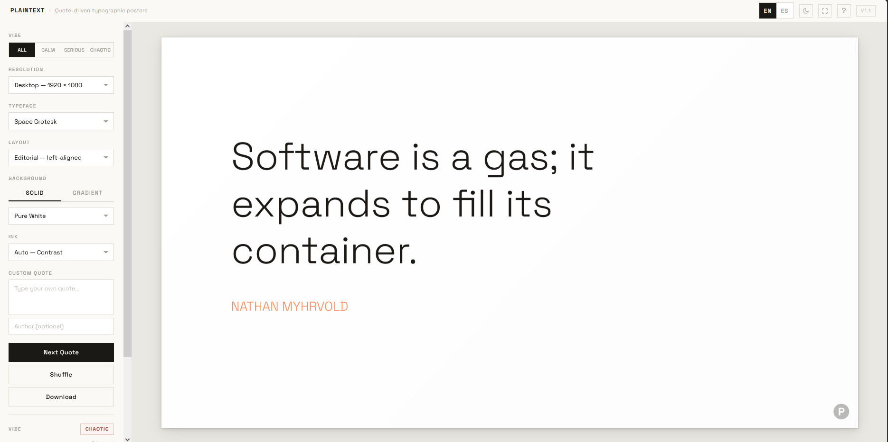

# Plaintext

**Typography-driven wallpaper generator.** Create beautiful, minimal posters from curated quotes or your own words.

## Overview

Plaintext is a minimalist web application designed for lovers of typography and literature. It transforms curated quotes into high-quality posters and wallpapers using professional layouts inspired by Swiss design and modernist principles. Supports desktop, mobile, Instagram, and OG/Twitter formats.

## Features

- **Curated Quotes**: Over 100 hand-picked quotes across 3 vibes (Calm, Chaotic, Serious) in both English and Spanish.
- **Custom Quotes**: Enter your own text to create personalized typographic posters.
- **Typography Focus**: 10 Google Fonts selected for their professional weight and character.
- **Pattern Backgrounds**: Subtle typographic overlays that blend massive letters into the background using gradient fills and ultra-low opacity.
- **Zen Mode (Z)**: Hide the UI to focus entirely on the composition.
- **Dark Mode**: A sleek, dark interface for a comfortable creative experience.
- **Bilingual Support**: Instant toggle between English and Spanish.
- **Flexible Layouts**: Choose between Editorial (Swiss-style), Ruled (Grid-based), or Offset (Asymmetric) compositions.
- **Social Resolutions**: Export for Instagram (1080×1080) or OG/Twitter (1200×630) in addition to desktop and mobile.
- **Export Everywhere**: Download high-resolution PNGs for any format. Filenames and watermarks include `mendiak.github.io/plaintext` for easy reference.

## Keyboard Shortcuts

The app is built for speed:
- `Space`: Generate a new quote
- `S`: Shuffle all styles (Font, Layout, Background, Pattern)
- `D`: Download wallpaper
- `Z`: Toggle Zen Mode
- `1`, `2`, `3`: Switch layouts
- `?`: Toggle shortcuts panel
- `Esc`: Exit Zen mode or close panels

## Background & Styles

- **Color Palettes**: Curated solid backgrounds (Clay, Slate, Charcoal, etc.) or dynamic gradients based on the quote's vibe.
- **Pattern Overlays**: Typographic pattern — massive, rotated letters from the quote filled with the vibe's accent color at ultra-low opacity, creating an atmospheric texture behind the text. Expandable to geometric and mesh styles.
- **Ink Control**: Auto-contrast selection or manual override (Ghost White, Steel Grey, Deep Black).
- **Proportions**: Optimized for Desktop (1920×1080), Mobile (1080×1920), Instagram (1080×1080), and OG/Twitter (1200×630).

## Technologies

- **HTML5 Canvas**: Native rendering for sharp typography and pattern overlays.
- **Vanilla JavaScript**: Pure ES6 modules, zero dependencies.
- **CSS3**: Fluid layouts using CSS Grid and Flexbox with a minimalist aesthetic.

## License

MIT License - see [LICENSE](LICENSE) for details.

---

*Less is more. Typography as art.*